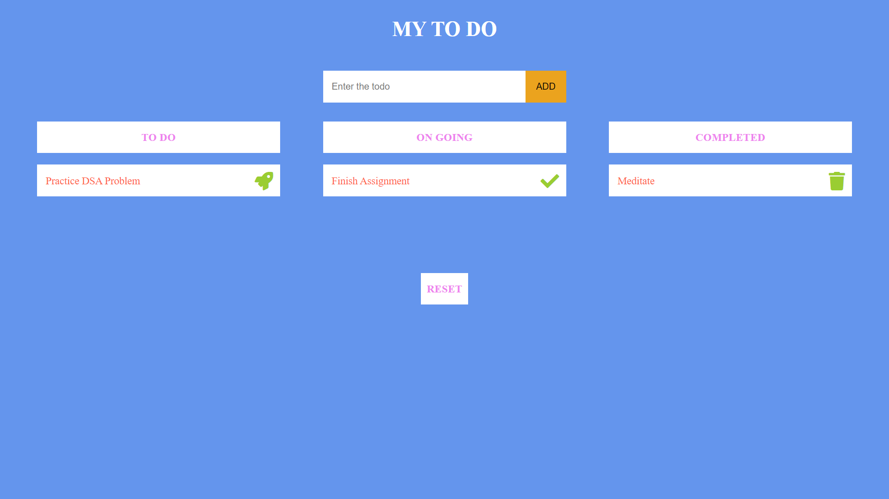

## To-Do-App

 **Website link - [TO-DO-APP](https://sivakumar32521.github.io/TO-DO-APP)**

## Features

- To do list, Ongoing list and Completed list is available (To see what are the task needs to be done, ongoing task and completed task).
- #### In to do list
  - Click 🚀 button available in the to do list to shift that task in to the ongoing list.
  - Created Tasks can be deleted in the to do list by double clicking it.
- #### In ongoing list
  - Click ✔ button available in the ongoing list to shift that task in to the completed list.
- #### In completed list
  - Click 🗑 button available in the completed list to delete that task.
- Click **reset** button to clear all data.
- Local Storage is used (App data will not be deleted until user click **reset** button or until user brower history is cleared).
- Responsive web application.

## Guide

- ##### First
  - Enter the task needs to be done. (After entering you can see the task in the to do list).

- ##### Second
  - Click 🚀 button available in the to do list to shift that task in to the ongoing list.
  - If you think some tasks are not needed in the to do list, double click on that task to delete it.

- ##### Third
  - After completing the task, Click ✔ button available in the ongoing list to shift that task in to the completed list.

- ##### Fourth
  - In completed list you can see all your completed tasks. Click 🗑 button available in the completed list to delete that task.

- ##### Fifth
  - To clear all your data click **RESET** button available at the bottom of the web page. 

## Tech Stack Used

- HTML
- CSS
- JAVASCRIPT
- JSON
